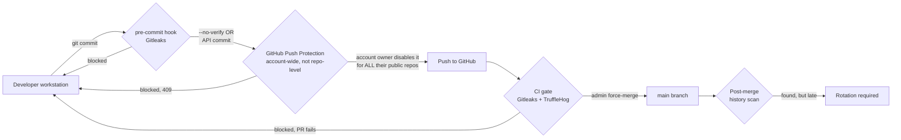

```mermaid
flowchart LR
    A[Developer workstation] -->|git commit| B{pre-commit hook<br/>Gitleaks}
    B -->|blocked| A
    B -->|--no-verify OR<br/>API commit| C{GitHub Push Protection<br/>account-wide, not repo-level}
    C -->|blocked, 409| A
    C -->|account owner disables it<br/>for ALL their public repos| D[Push to GitHub]
    D --> E{CI gate<br/>Gitleaks + TruffleHog}
    E -->|blocked, PR fails| A
    E -->|admin force-merge| F[main branch]
    F --> G{Post-merge<br/>history scan}
    G -->|found, but late| H[Rotation required]
```

